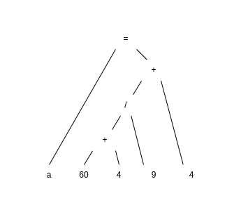

The goal of the project was to create an interpreter of a programming language of an own idea. 
The project had a purely academic purpose and therefore the documentation is available only in Polish; 
however, the code and all the comments were kept in English. Take a look also at the [grammar of the language](#Gramatyka). 

# Dokumentacja

Nazwa projektu: `Żmija` \
Autor: Marcin Grabysz \
Opiekun projektu: Piotr Gawkowski

Celem projektu jest napisanie interpretera języka o składni podobnej do języka Python,
z możliwością wykonywania podstawowych operacji na zmiennych typu
int, float i bool, a także definiowania własnych funkcji i klas. Język Żmija<sup>TM</sup> domyślnie używa słów
kluczowych i nazw funkcji wbudowanych w języku polskim, lecz możliwe dodanie własnej konfiguracji językowej.

```
główna() {
    napisz("Witaj świecie!);
}
```

## Praca z interpreterem

### Konfiguracja

Do skonfigurowania działania interpretera służą dwa pliki konfiguracyjne umieszczone w folderze
`src/main/resources`:

* `properties.config` (ogólne ustawienia programu)
* `polish.config` (nazwy słów kluczowych i funkcji wbudowanych)

Aby wprowadzić własną konfigurację językową, można utworzyć własny plik konfiguracyjny i zdefiniować słowa kluczowe
w pożądanym języku zgodnie ze schematem z `polish.config`, na przykład dla języka hiszpańskiego może być
to `spanish.config`:

```properties
RETURN=devolver
FOR=por
IN=en
IF=se
ELSE=contrario
# itd.
```

Następnie ścieżkę do nowo utworzonego pliku należy umieścić w `properties.config` jako parametr `language.config.path`.
W pliku `properties.config` można ustawić również własne limity długości identyfikatora, komentarza, tekstu (jako
argumentu funkcji `napisz()`) oraz komunikatu o błędzie:

```properties
language.config.path=src/main/resources/polish.config
identifier.maxlength=256
comment.maxlength=1024
text.maxlength=1024
error.message.expression.maxlength=24
```

**Uwaga:** testy jednostkowe zakładają korzystanie z domyślnej konfiguracji

### Uruchomienie interpretera

Zaleca się budowanie projektu z użyciem narzędzia do automatyzacji kompilacji `Gradle`. Po zainstalowaniu `Gradle` na
swoim środowisku, należy skompilować program do pliku .jar:

```shell
gradle build jar
```

Po upewnieniu się, że w folderze `build/libs` został utworzony pli `Viper-1.0-SNAPSHOT.jar`, można uruchomić interpreter
skryptem `viper.sh`, podając jako argument ścieżkę do pliku .txt do zinterpretowania. Przykładowe fragmenty kodu
znajdują się w folderze `examples`.

**Uwaga:** skrypty w folderze `examples` zakładają korzystanie z domyślnej konfiguracji językowej

Przykładowe uruchomienie programu:

```shell
sh viper.sh examples/fibonacci.txt
```

## Charakterystyka języka

#### Proste typy danych

`int, float, bool, text (tylko jako argument funkcji napisz())`

#### Złożone typy danych

`Lista` -> `dodaj(elem), usuń(index), pobierz(indeks), długość()`

#### Operacje

###### arytmetyczne

`+, -, *, /, +=, -=`

###### relacyjne

`<, >, <=, >=, ==, !=`

###### logiczne

`oraz, lub, nie`

#### Słowa kluczowe i pozostałe symbole

###### w pętli

`dla i w zakres(start, stop) {}`
`dla elem w Lista {}`

###### w instrukcji warunkowej

`jeżeli () {} inaczej {}`

###### w definicji klasy

`klasa` - poprzedza definicję klasy \
`tenże` - przedrostek oznaczający atrybuty klasy \
Patrz: [przykład definiowania klasy](#definiowanie-klasy-i-funkcji)

#### Instrukcje

`{ciało funkcji/pętli/instrukcji warunkowej} w nawiasach klamrowych`

`(parametry funkcji w nawiasach okrągłych)`

`instrukcja kończy się średnikiem;`

#### Zmienne

* Typowanie dynamiczne
* Typowanie słabe
* Zmienne mutowalne
* Przekazywanie złożonych typów danych przez referencję
* Przekazywanie prostych typów danych przez wartość

#### Definiowanie funkcji

`mojaFunkcja(parametr1, parametr2) {}`

#### Funkcje wbudowane

* `napisz("Witaj świecie", ...)` - wypisuje tekst lub wartość zmiennej w konsoli, przyjmuje dowolną liczbę argumentów
* `zakres(start, stop)` - zwraca listę zawierającą liczby całkowite od `start` (włącznie) do `stop` (wyłącznie)
* `zakończ()` - przerywa wykonanie programu

#### Definiowanie własnych typów

Użytkownik może definiować własne typy bez dziedziczenia. Klasy mogą agregować inne klasy. Każda klasa musi zawierać
konstruktor (metodę o nazwie identycznej z nazwą klasy), który nie zawiera instrukcji `zwróć`. Definiowanie atrybutów
może odbyć się tylko w konstruktorze. Metody klasy mogą czytać lub nadpisywać atrybuty, próba utworzenia nowego
atrybutu poza konstruktorem skutkuje podniesieniem wyjątku.
Patrz: [przykład definiowania klasy](#definiowanie-klasy-i-funkcji)

#### Komentarze

`// tekst po podwójnym ukośniku jest interpretowany jako komentarz`

#### Struktura programu

Obowiązkowe jest zdefiniowanie w pliku funkcji `główna()`, której wykonanie stanowi interpretacja kodu. Pozostałe
definicje klas oraz funkcji mogą znajdować się zarówno nad, jak i pod definicją funkcji głównej. Żadne wyrażenie nie
może znajdować się poza definicją klasy lub funkcji.

### Przykłady konstrukcji językowych

#### Operacje matematyczne i logiczne

```
x = 10 + 20 - 5 * (3+2);
x += 5;
y = 10.5 / 2;
z = x * y;
var1 = z >= x;
var2 = var1 lub (x == 10);
var3 = ((y > 5) oraz var2) lub z < 0;
```

#### Operacje na obiekcie Lista

```
numery = Lista();
numery.dodaj(10);
numery.dodaj(20);
i = numery.pobierz(1);
numery.usuń(0);
numery.dodaj(1.2);

lista = Lista();
lista.dodaj(prawda);
lista.dodaj(4 > 3);
lista.dodaj(4.20 * 10);
napisz(lista.pobierz(2));
```

#### Pętle i instrukcje warunkowe

```
lista = Lista();
dla i w zakres(0, 10) {
  lista.dodaj(i * 10);
}
dla i w lista {   // i nie jest widoczne poza pętlą
  jeżeli (i > 50) {
      napisz(i, " jest większe od 50 \n");
  } inaczej {
      napisz(i, " nie jest większe od 50 \n");
  }
}
```

#### Definiowanie klasy i funkcji

```
// script presenting a definition of class and mehtods
klasa Ułamek {

  Ułamek(l, m) {            // konstruktor
    tenże.licznik = l;
    tenże.mianownik = m;
    jeżeli (m == 0) {
        zakończ();
    }
    jeżeli (l < m) {
        tenże.jestWłaściwy = prawda;    // ułamek właściwy to taki, który jest mniejszy od 1
    } inaczej {
        tenże.jestWłaściwy = fałsz;
    }
  }

  rozszerz(i) {
    tenże.licznik = tenże.licznik * i;
    tenże.mianownik = tenże.mianownik * i;
  }
}

zdefiniuj(l, m) {
  a = Ułamek(l, m);
  jeżeli (a.jestWłaściwy) {
    napisz("Zdefiniowano właśnie ułamek właściwy");
  } inaczej {
    napisz("Zdefiniowano właśnie ułamek niewłaściwy");
  }
  napisz("licznik: ", a.licznik, " mianownik: ", a.mianownik);
  a.rozszerz(2);
  napisz("rozszerzony licznik: ", a.licznik,
        " rozszerzony mianownik: ", a.mianownik);

}

główna() {
  zdefiniuj(1, 2);
  zdefiniuj(3, 2);
}
```

#### Słowo kluczowe zwróć

```
silnia(numer) {
    jeżeli (numer == 1) {
        zwróć 1;
    } inaczej {
        zwróć silnia(numer - 1) * numer;
    }
}
```

### Niepoprawne konstrukcje i komunikaty wyjątków

#### na poziomie leksykalnym

```
var = 123abc;
var2 = @$abc;
Undefined expression: 123abc at line x position y
```

```
var = 2147483648;
Numeric expression: 214748364... at line 0 position 0 exceeds limit
```

```
"abcdefgh
End of file reached while parsing text: abcdefgh starting at line x position y
```

Oraz (maksymalna długość jest konfigurowana dla identyfikatorów, komentarzy i tekstów z osobna):

```
Identifier: aaaaaaaaaaaaaaaaaaaaaaaa... starting at line x position y exceeds maximal length
Text: aaaaaaaaaaaaaaaaaaaaaaaa... starting at line x position y exceeds maximal length
Comment: aaaaaaaaaaaaaaaaaaaaaaaa starting at line x position y exceeds maximal length
```

#### na poziomie składniowym

```
mult (a,b { 
    return a*b; 
} 

While parsing statement << mult ( a , b >> at line 1 position 9 given problem was found: CLOSING_PARENTHESIS_MISSING
```

```
main() { 
    jeżeli (a==2) 
}

While parsing statement << jeżeli ( a == 2 ) >> at line 1 position 22 given problem was found: CONDITIONAL_STATEMENT_BODY_EXPECTED
```

```
main() { 
    a = b 
}

While parsing statement << a = b >> at line 1 position 14 given problem was found: SEMICOLON_EXPECTED
```

#### na poziomie semantycznym

```
1 + 2 * prawda

Semantic error of type: OPERATION_NOT_SUPPORTED: << 2 * prawda >> at line 1
```

```
2 * 4 / 0

Semantic error of type: ZERO_DIVISION: << 2 * 4 / 0 >> at line 1
```

```
główna() { a = b; }

Semantic error of type: VARIABLE_NOT_DEFINED_IN_SCOPE: << b >> at line 2
```

## Gramatyka

```
program                 = {definition};

definition              = function-definition | class-definition

function-definition     = identifier, "(", [parameters-list], ")", block;

class-definition        = class-keyword, identifier, class-body;

class-body              = "{", {function-definition}, "}";

block                   = "{", {statement}, "}";

statement               = object-access, [assignment], ";"
                        | if-statement
                        | for-statement
                        | return-statement
                      
object-access           = (title | this-keyword), {".", title};
                        
title                   = identifier, ["(", arguments-list, ")"];

assignment              = ("=" | "+=" | "-="), expression;

if-statement            = if-keyword, "(", expression, ")", block, [else-keyword, block];

for-statement           = for-keyword, identifier, in-keyword, object-access, block;

return-statement        = return-keyword, [expression], ";";

expression              = or-expression;

or-expression           = and-expression, {or-keyword, and-expression};

and-expression          = relational-expression, {and-keyword, relational-expression};

relational-expression     = arithmetic-expression, [relational-operator, arithmetic-expression];

arithmetic-expression   = multiplicative-expression, {("+" | "-"), multiplicative-expression};

multiplicative-expr.    = factor, {("*" | "/"), factor};

factor                  = [negation], (literal | object-access | "(", expression, ")");

parameters-list         = identifier, {",", identifier};

arguments-list          = expression, {",", expression};

identifier              = letter, {letter | digit};

literal                 = integer
                        | float
                        | bool
                        | text;

integer                 = "0" | (non-zero-digit, {digit});

float                   = integer, ".", digit, {digit};

bool                    = true-keyword | false-keyword;

text                    = '"', {char}, '"';

char                    = ({letter} | {digit} | {special-symbol}), {char},

negation                = not-keyword | "-";

relational-operator       = "==" | "!=" | "<" | ">" | ">=" | "<=";

letter                  = "A" | "B" | "C" | ... | "Z" | "a" | "b" | "c" | ... | "z" | "_";

non-zero-digit          = "1" | "2" | "3" | ... | "9";

digit                   = "0" | non-zero-digit;

special-symbol          = " " | "\" | "!" | "@" | ...

class-keyword           = "klasa";

if-keyword              = "jeżeli";

else-keyword            = "inaczej";

for-keyword             = "dla";

in-keyword              = "w";

return-keyword          = "zwróć";

this-keyword            = "tenże";

or-keyword              = "lub";

and-keyword             = "oraz";

not-keyword             = "nie";

true-keyword            = "prawda";

false-keyword           = "fałsz";
```

## Analiza wymagań

* Interpreter ogranicza wielkość pliku wejściowego oraz długość konkretnego tokenu, ma to na celu uniemożliwienie
  przepełnienia bufora
* Interpreter umożliwia przerwanie wykonywania programu skrótem klawiszowym
* W celu dostarczenia precyzyjnej informacji o błędzie w programie, obiekty typu `Token` przechowują swoją pozycję
  w pliku (numer linii, pozycja znaku w linii). Więcej w punkcie [Analizator leksykalny](#analizator-leksykalny)
* Aby informacja o pozycji błędu programu mogła być przekazana przez analizator semantyczny, pozycja tokenu jest
  przekazywana do odpowiedniego węzła drzewa rozbioru składniowego

## Realizacja

#### Analizator leksykalny

Analizator leksykalny (lekser) jest modułem odpowiedzialnym za przetworzenie pliku wejściowego na ciąg tokenów.
Lekser oczekuje dwóch argumentów:

* `eventHandler` - wyrażenie lub funkcja określające, co należy wykonać przy napotkaniu błędu
* `bufferedReader` - obiekt typu `BufferedReader` stanowiący źródło znaków do interpretacji.

Lekser pobiera znaki _leniwie_, tj. w momencie, w którym potrzebuje kolejnego znaku. Każdy znak po pobraniu jest poddany
analizie, po której zakończeniu zostaje pobrany kolejny znak. Znak lub grupa znaków może zostać zinterpretowana jako
Token.
Natrafienie na ciąg niemożliwy do zinterpretowania ciąg znaków lub token przekraczający dopuszczalną wielkość powoduje
rzucenie wyjątku (
patrz: [Niepoprawne konstrukcje i komunikaty wyjątków na poziomie leksykalnym](#na-poziomie-leksykalnym)).

Interfejs klasy Token

```java
public interface Token {
    TokenType getType();

    Position getPosition();

    <V> V getValue();
}
```

Token posiada swój typ, pozycję w pliku wejściowym oraz (dla pewnych typów) wartość.

Rozpoznawane typy tokenów to:

* END_OF_FILE
* COMMENT
* słowa kluczowe: RETURN, FOR, IF, ELSE, CLASS, THIS
* symbole: OPEN_BRACKET, CLOSE_BRACKET, OPEN_PARENTHESIS, CLOSE_PARENTHESIS, SEMICOLON, COMA, DOT, ASSIGN,
  ADD_AND_ASSIGN, SUBTRACT_AND_ASSIGN
* operatory porównania: EQUAL, NOT_EQUAL, GREATER, LESS, GREATER_OR_EQUAL, LESS_OR_EQUAL
* operatory logiczne: AND, OR, NOT
* operatory matematyczne: ADD, SUBTRACT, MULTIPLY, DIVIDE
* wartości liczbowe i logiczne: INTEGER, FLOAT, BOOL, TEXT
* IDENTIFIER

#### Analizator składniowy

Analizator składniowy (parser) jest modułem odpowiedzialnym za przetworzenie strumienia tokenów na drzewo rozbioru
składniowego.
Parser oczekuje dwóch argumentów:

* `eventHandler` - wyrażenie lub funkcja określające, co należy wykonać przy napotkaniu błędu
* `Lexer` - obiekt implementujący interfejs `Lexer`, stanowiący źródło do tokenów do interpretacji

Analiza odbywa się w sposób rekursywnie zstępujący. Drzewo jest zaimplementowane jako zbiór powiązanych
ze sobą rekordów, z których najwyższy w hierarchii `Program` przechowuje mapy `functions` i `classes` mapujące nazwę
na odpowiednio funkcje i klasy programu. Przechowywanie klas i funkcji (także metod w kontekście danej klasy) w mapach
zapewnia unikalność nazw w danym kontekście.

Token typu `COMMENT` jest ignorowany przez parser.

Przykład drzewa dla wyrażenia arytmetycznego:

`a = (60 + 4) / 9 + 4`



Niemożliwość utworzenia poprawnego drzewa skutkuje podniesieniem wyjątku
(patrz: [Niepoprawne konstrukcje i komunikaty wyjątków na poziomie składniowym](#na-poziomie-składniowym)).
W celu wyświetlenia kontekstu (fragmentu kodu) wystąpienia błędu, parser tworzy i uaktualnia obiekt
klasy `ErrorContext`,
który na podstawie przetwarzanych tokenów na bieżąco tworzy kontekst. Po przetworzeniu poprawnej instrukcji w kodzie
źródłowym, `ErrorContext` zostaje zresetowany i jego budowa zaczyna się od kolejnej instrukcji.

#### Analizator semantyczny

Analizator semantyczny (interpreter) jest modułem odpowiedzialnym za analizę drzewa rozbioru i wykonania zawartych w nim
instrukcji.
Interpreter oczekuje dwóch argumentów:

* `eventHandler` - wyrażenie lub funkcja określające, co należy wykonać przy napotkaniu błędu
* `testingMode` - `boolean` (opcjonalny, domyślnie `false`), w przypadku `true` wyjście interpretowanego programu
  nie będzie przekazywane do wyjścia standardowego, lecz zapisane w wewnętrznym buforze.

Interpretacja programu rozpoczyna się wywołaniem metody Interpretera `execute`, która przyjmuje jako argument obiekt
typu `Program` (drzewo rozbioru stworzone przez Parser). Węzły drzewa przetwarzane są zgodnie ze wzorcem projektowym
"Visitor", zgodnie z którym rozwój funkcjonalności analizatora semantycznego odbywa się bez modyfikowania kodu drzewa.
Węzły jedyne akceptują wywołanie na nich metod "visitora".

Interpretacja programu zaczyna się od dodania do drzewa rozbioru funkcji
wbudowanych (`napisz()`, `zakończ()`, `zakres()`)
oraz definicji klasy `Lista`. Następnym krokiem jest analiza wszystkich definicji klas i zweryfikowanie, czy posiadają
poprawnie zdefiniowane konstruktory (w przeciwnym razie zgłaszany jest wyjątek) i dodanie ich do mapy `constructors`
(konstruktory muszą być dostępne z kontekstu każdej metody). Po analizie klas interpreter odszukuje funkcję główną
(jej brak skutkuje wyjątkiem) i rozpoczyna wizytację kolejnych poleceń.

Za widoczność zmiennych lokalnych w odpowiednim kontekście odpowiada klasa `Environment`, która przechowuje na stosie
obiekty typu `FunctionCallContext`. W momencie wywołania funkcji (lub metody), na szczycie stosu tworzony jest nowy
`FunctionCallContext`, w którym zapisywane są referencje na argumenty funkcji. W tym samym kontekście są zapisywane
wszystkie zmienne lokalne, które funkcja utworzy w czasie swojego wykonywania. Nie ma możliwości odczytania wartości
zmiennych zapisanych w innym kontekście — umożliwia to zagnieżdżanie, a nawet rekursywne wywoływanie funkcji.
W obrębie jednego kontekstu istnieją także zakresy (`scope`) odpowiadające poszczególnym instrukcjom (np. do wartości
iteratora w poleceniu pętli nie można dostać się spoza pętli).

Projekt zawiera także dwie inne implementacje wzorca "Visitor":

* `PrinterVisitor` - umożliwia wizytację drzewa rozbioru i pokazanie struktury w konsoli (aktualnie nieużywany w
  projekcie)
* `ErrorContextBuilder` - umożliwia utworzenie kontekstu w komunikacie wystąpienia błędu. Udostępnia statyczną
  metodę `buildContext()`, przyjmującą wyrażenie, w którym wystąpił błąd.

## Sposób testowania

Do przetestowania analizatora leksykalnego służą testy jednostkowe sprawdzające, czy na podstawie danego pliku
wejściowego lekser zwróci oczekiwaną listę tokenów lub podniesie oczekiwany wyjątek.

Do przetestowania analizatora składniowego służą testy jednostkowe sprawdzające, czy na podstawie danego strumienia
tokenów parser utworzy oczekiwane drzewo rozbioru składniowego lub podniesie oczekiwany wyjątek. Testy jednostkowe
obsługują również integrację leksera z parserem (testowanie budowania drzewa na podstawie pliku wejściowego).
Dla każdego typu wyjątku zgłaszanego przez parser istnieje test jednostkowy, który sprawdza jego wywołanie.

Analizator składniowy jest najtrudniejszy do przetestowania automatycznie, jednak istnieją testy sprawdzające jego
poszczególne komponenty, a więc `Environment` i "komputery" (obiekty wykonujące operacje matematyczne, relacyjne lub
logiczne). Istnieje także grupa testów jednostkowych sprawdzających podnoszenie wyjątków przez interpreter oraz testy
sprawdzające, czy wyjście standardowe programu zgadza się z oczekiwanym (za pomocą trybu testowego interpretera).

## Dostępne skrypty w języku Żmija<sup>TM</sup>

Skrypty znajdują się w folderze `examples`. Każdy z nich prezentuje poprawne działanie pewnej funkcjonalności języka

* `definitions` - zdefiniowanie i utworzenie obiektu oraz wywołanie jego metod
* `counter` - wywołanie metody i symbol modyfikacji i przypisania (`+=`)
* `factorial` - rekursywne wywołanie funkcji
* `fibonacci` - instrukcja pętli oraz funkcja wbudowana `zakres()`
* `reference` - przekazanie obiektu przez referencję i zmiana jego atrybutu
* `value` - przekazanie prostego typu przez wartość
